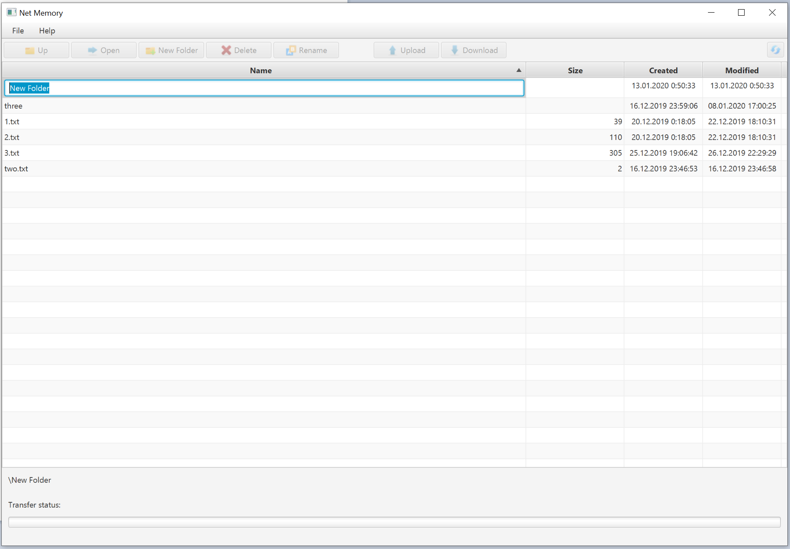

# FileStorage
is an example client-server project I've done as a Java course project assignment. It consists of a file storage on the server side which allows the registered clients to store and manage files and folders and a desktop client UI application to manage the storage. The client-server data exchange is implemented upon the netty framework. The business commands and data are transferred using the standard java serialization.

## Server
manages a remote file storage for registered users allowing users uploading and downloading files, as well as creating folders, going into folders and out, removing and renaming files and folders.
The server is implemented on:
- netty -to manage client/server network communications
- SQLite database (file-server-users.db3) and SQLite JDBC driver to manage usernames
- Log4j2 for logging
Required files:
- file-server-users.db3 - Users database, must be located in the CLASSPATH directory
- config.properties - contains server settings
- Log4j2.xml - must be put to the src/resources directory to compile

## Client
is a window application made with JavaFX 2.0  framework. It consists of a single stage (window) and two scenes - logon\register and main. It allows storing server host and port and last logged on username in the filestorage.properties file.
Architecture:
- The Logon / Register scene allows logging on or registering. Navigation among both is implemented by showing \ hiding the corresponding VBox in the StackPane.
- The Main scene is implemented in a VBox pane and along with the others contains a TableVeiw to show a client's storage content. 

Allowed operations:
- refresh and display the content of the current folder
- go to the upper folder (if any)
- open and show the content of the selected folder
- create a new folder (editing the name is in the top table line with the TableView edit-mode on)
- rename a file or a folder is done the same way as creating a new folder - in the table
- delete a file or a folder
- download a file from the server
- upload a file to the server

## file-storage-common package
Contains the common file command classes, interfaces and logic shared by both the server and the client.

## Pictures
### 1. Logon form

### 2. Register form

### 3. Downloading a file

### 4. Creating a folder

